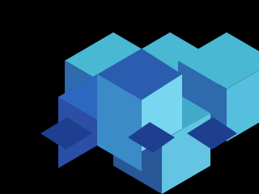

# Hi, I'm SouL

I'm learning Machine learning by rebuilding the ideas behind the tools I use.

## 🛠️ Languages & tools

The stack I’m learning and building with as I turn ML fundamentals into small, understandable projects.

### Python & Machine learning

  
  

### Backend

  
  

### Developer workflow

  
  

### Systems & other skills

  

## What I'm working on

- Rebuilding a scalar automatic-differentiation engine in Python
- Understanding backpropagation instead of treating `loss.backward()` as magic
- Learning PyTorch through small experiments and classification projects
- Documenting the concepts, mistakes, and code as I go
- Working toward building a GPT-2-style model from scratch.

## Featured project

### [Micrograd++](https://github.com/soulcodesmith/Micrograd-Plus-Plus)

A small scalar autograd engine inspired by Karpathy's micrograd.

It currently includes:

- computation-graph tracking;
- reverse-mode automatic differentiation;
- arithmetic operations and `tanh`;
- hand-written gradient checks;
- a readable implementation designed for learning.

## Current focus

I am currently working on:

- comparing my gradients with PyTorch;
- adding neural-network building blocks;
- training a small MLP on XOR;
- becoming more comfortable writing Python without copying solutions.

## Learning in public

I care more about understanding the mechanism than collecting libraries. My repositories are experiments and checkpoints from that process.
